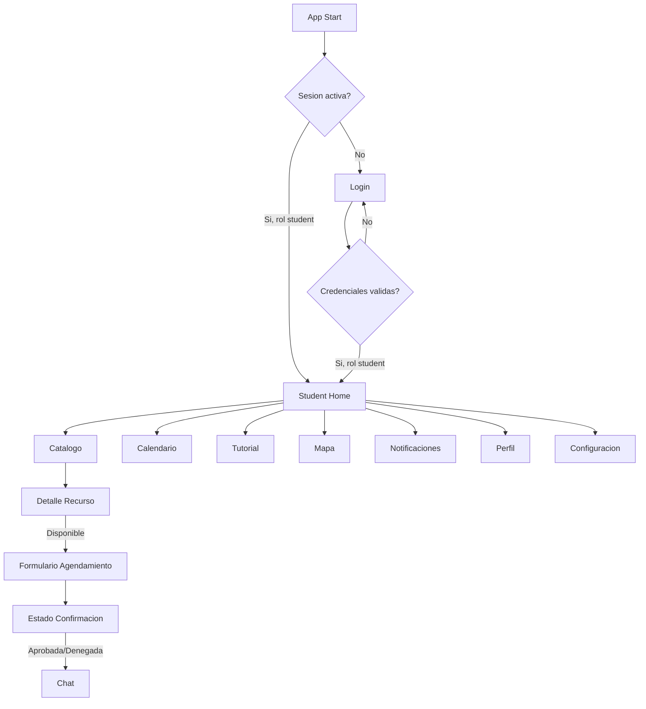
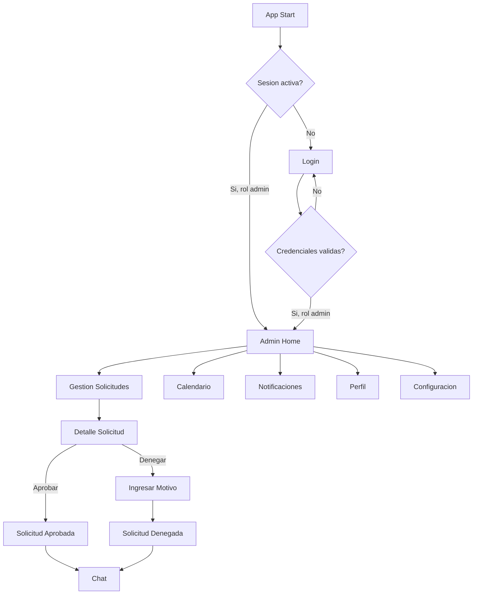
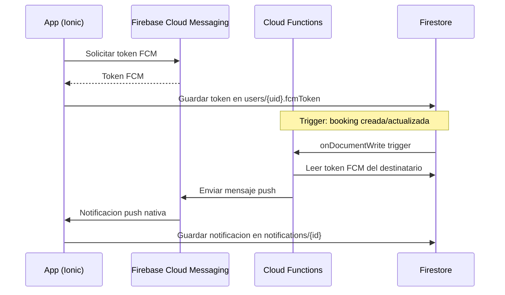

# Documento de Diseno Neogranada Conecta

## Diseno Visual e Identidad Institucional

### Variables SCSS (src/theme/variables.scss)

```scss
// ============================================================
// Paleta Institucional UMNG
// ============================================================
:root {
  // Colores primarios
  --color-primary: #1a2a4a;
  --color-primary-rgb: 26, 42, 74;
  --color-primary-contrast: #ffffff;
  --color-primary-shade: #162440;
  --color-primary-tint: #2d3f5c;

  // Colores de acento (dorado institucional)
  --color-accent: #f0c040;
  --color-accent-rgb: 240, 192, 64;
  --color-accent-contrast: #1a2a4a;
  --color-accent-shade: #d4aa38;
  --color-accent-tint: #f2c653;

  // Colores de superficie
  --color-surface: #ffffff;
  --color-surface-variant: #f5f7fa;
  --color-background: #1a2a4a;

  // Colores de estado
  --color-success: #2dd36f;
  --color-warning: #ffc409;
  --color-danger: #eb445a;
  --color-medium: #92949c;

  // Tipografia
  --font-family-base: 'Roboto', -apple-system, BlinkMacSystemFont, 'Segoe UI', sans-serif;
  --font-size-xs: 11px;
  --font-size-sm: 13px;
  --font-size-base: 15px;
  --font-size-md: 17px;
  --font-size-lg: 20px;
  --font-size-xl: 24px;
  --font-size-xxl: 32px;

  // Espaciado
  --spacing-xs: 4px;
  --spacing-sm: 8px;
  --spacing-md: 16px;
  --spacing-lg: 24px;
  --spacing-xl: 32px;
  --spacing-xxl: 48px;

  // Bordes
  --border-radius-sm: 8px;
  --border-radius-md: 12px;
  --border-radius-lg: 16px;
  --border-radius-xl: 24px;
  --border-radius-full: 9999px;

  // Sombras
  --shadow-sm: 0 1px 3px rgba(0, 0, 0, 0.12), 0 1px 2px rgba(0, 0, 0, 0.08);
  --shadow-md: 0 4px 6px rgba(0, 0, 0, 0.15), 0 2px 4px rgba(0, 0, 0, 0.10);
  --shadow-lg: 0 10px 15px rgba(0, 0, 0, 0.20), 0 4px 6px rgba(0, 0, 0, 0.12);

  // Transiciones
  --transition-fast: 150ms ease-in-out;
  --transition-base: 250ms ease-in-out;
  --transition-slow: 400ms ease-in-out;

  // Ionic overrides
  --ion-color-primary: var(--color-primary);
  --ion-color-primary-rgb: var(--color-primary-rgb);
  --ion-color-primary-contrast: var(--color-primary-contrast);
  --ion-color-primary-shade: var(--color-primary-shade);
  --ion-color-primary-tint: var(--color-primary-tint);

  --ion-background-color: var(--color-background);
  --ion-text-color: var(--color-surface);
  --ion-toolbar-background: var(--color-primary);
  --ion-toolbar-color: var(--color-surface);
  --ion-item-background: transparent;
  --ion-card-background: var(--color-surface);
  --ion-card-color: var(--color-primary);
}

// Modo oscuro
@media (prefers-color-scheme: dark) {
  :root {
    --color-surface: #1e2a3a;
    --color-surface-variant: #253347;
    --color-background: #0f1a2a;
    --ion-card-background: var(--color-surface);
    --ion-card-color: #e8edf5;
  }
}

.dark-theme {
  --color-surface: #1e2a3a;
  --color-surface-variant: #253347;
  --color-background: #0f1a2a;
  --ion-card-background: var(--color-surface);
  --ion-card-color: #e8edf5;
}
```

### Componentes Shared

#### Card Component (src/app/shared/components/card/)

```html
<!-- neo-card.component.html -->
<div class="neo-card" [class.neo-card--elevated]="elevated">
  <div class="neo-card__header" *ngIf="title">
    <h3 class="neo-card__title">{{ title }}</h3>
    <ng-content select="[card-action]"></ng-content>
  </div>
  <div class="neo-card__body">
    <ng-content></ng-content>
  </div>
</div>
```

```scss
// neo-card.component.scss
.neo-card {
  background: var(--color-surface);
  border-radius: var(--border-radius-lg);
  padding: var(--spacing-md);
  box-shadow: var(--shadow-sm);
  color: var(--color-primary);
  transition: box-shadow var(--transition-fast);

  &--elevated {
    box-shadow: var(--shadow-md);
  }

  &__title {
    font-size: var(--font-size-md);
    font-weight: 600;
    color: var(--color-primary);
    margin: 0;
  }

  &__header {
    display: flex;
    justify-content: space-between;
    align-items: center;
    margin-bottom: var(--spacing-sm);
  }
}
```

#### Avatar Component (src/app/shared/components/avatar/)

Muestra la foto de perfil del usuario o sus iniciales sobre fondo dorado si no hay imagen.

```typescript
@Component({
  selector: 'neo-avatar',
  standalone: true,
  template: `
    <div class="neo-avatar" [style.width.px]="size" [style.height.px]="size">
      
      <ng-template #initials>
        <span class="neo-avatar__initials" [style.font-size.px]="size * 0.35">
          {{ getInitials(fullName) }}
        </span>
      </ng-template>
    </div>
  `
})
export class AvatarComponent {
  @Input() fullName = '';
  @Input() photoURL?: string;
  @Input() size = 40;

  getInitials(name: string): string {
    return name
      .split(' ')
      .filter(w => w.length > 0)
      .map(w => w[0].toUpperCase())
      .slice(0, 2)
      .join('');
  }
}
```

#### Badge Component (src/app/shared/components/badge/)

Muestra el contador de notificaciones no leidas sobre un icono.

```typescript
@Component({
  selector: 'neo-badge',
  standalone: true,
  template: `
    <div class="neo-badge-wrapper">
      <ng-content></ng-content>
      <span class="neo-badge" *ngIf="count > 0">
        {{ count > 99 ? '99+' : count }}
      </span>
    </div>
  `
})
export class BadgeComponent {
  @Input() count = 0;
}
```

---

## Flujo de Navegacion por Rol

### Flujo del Estudiante



### Flujo del Administrador



---

## Configuracion de Firebase y Capacitor

### src/environments/environment.ts

```typescript
export const environment = {
  production: false,
  firebase: {
    apiKey: 'YOUR_DEV_API_KEY',
    authDomain: 'neogranada-conecta-dev.firebaseapp.com',
    projectId: 'neogranada-conecta-dev',
    storageBucket: 'neogranada-conecta-dev.appspot.com',
    messagingSenderId: 'YOUR_SENDER_ID',
    appId: 'YOUR_APP_ID',
    vapidKey: 'YOUR_VAPID_KEY'
  }
};
```

### src/environments/environment.prod.ts

```typescript
export const environment = {
  production: true,
  firebase: {
    apiKey: 'YOUR_PROD_API_KEY',
    authDomain: 'neogranada-conecta.firebaseapp.com',
    projectId: 'neogranada-conecta',
    storageBucket: 'neogranada-conecta.appspot.com',
    messagingSenderId: 'YOUR_PROD_SENDER_ID',
    appId: 'YOUR_PROD_APP_ID',
    vapidKey: 'YOUR_PROD_VAPID_KEY'
  }
};
```

### capacitor.config.ts (actualizado)

```typescript
import type { CapacitorConfig } from '@capacitor/cli';

const config: CapacitorConfig = {
  appId: 'co.edu.unimilitar.neogranada',
  appName: 'Neogranada Conecta',
  webDir: 'www',
  plugins: {
    SplashScreen: {
      launchShowDuration: 3000,
      launchAutoHide: true,
      backgroundColor: '#1a2a4a',
      androidSplashResourceName: 'splash',
      androidScaleType: 'CENTER_CROP',
      showSpinner: false
    },
    PushNotifications: {
      presentationOptions: ['badge', 'sound', 'alert']
    },
    StatusBar: {
      style: 'DARK',
      backgroundColor: '#1a2a4a'
    }
  }
};

export default config;
```

### Inicializacion de Firebase (src/main.ts)

```typescript
import { bootstrapApplication } from '@angular/platform-browser';
import { AppComponent } from './app/app.component';
import { provideRouter } from '@angular/router';
import { provideIonicAngular } from '@ionic/angular/standalone';
import { provideFirebaseApp, initializeApp } from '@angular/fire/app';
import { provideAuth, getAuth } from '@angular/fire/auth';
import { provideFirestore, getFirestore } from '@angular/fire/firestore';
import { provideMessaging, getMessaging } from '@angular/fire/messaging';
import { routes } from './app/app.routes';
import { environment } from './environments/environment';

bootstrapApplication(AppComponent, {
  providers: [
    provideIonicAngular({ mode: 'md' }),
    provideRouter(routes),
    provideFirebaseApp(() => initializeApp(environment.firebase)),
    provideAuth(() => getAuth()),
    provideFirestore(() => getFirestore()),
    provideMessaging(() => getMessaging())
  ]
});
```

---

## Reglas de Seguridad Firestore

```javascript
rules_version = '2';
service cloud.firestore {
  match /databases/{database}/documents {

    // Funciones auxiliares
    function isAuthenticated() {
      return request.auth != null;
    }

    function isOwner(userId) {
      return request.auth.uid == userId;
    }

    function getUserRole() {
      return get(/databases/$(database)/documents/users/$(request.auth.uid)).data.role;
    }

    function isAdmin() {
      return isAuthenticated() && getUserRole() == 'admin';
    }

    function isStudent() {
      return isAuthenticated() && getUserRole() == 'student';
    }

    // Coleccion users
    match /users/{userId} {
      allow read: if isAuthenticated() && (isOwner(userId) || isAdmin());
      allow create: if isAuthenticated() && isOwner(userId);
      allow update: if isAuthenticated() && isOwner(userId)
        && !request.resource.data.diff(resource.data).affectedKeys().hasAny(['role', 'uid', 'email']);
      allow delete: if false;
    }

    // Coleccion resources
    match /resources/{resourceId} {
      allow read: if isAuthenticated();
      allow write: if isAdmin();
    }

    // Coleccion bookings
    match /bookings/{bookingId} {
      allow read: if isAuthenticated() &&
        (isAdmin() || isOwner(resource.data.studentId));
      allow create: if isStudent() &&
        request.resource.data.studentId == request.auth.uid &&
        request.resource.data.status == 'pendiente';
      allow update: if isAdmin() &&
        request.resource.data.diff(resource.data).affectedKeys()
          .hasOnly(['status', 'denialReason', 'updatedAt']);
      allow delete: if false;
    }

    // Coleccion reservations
    match /reservations/{reservationId} {
      allow read: if isAuthenticated() &&
        (isAdmin() || isOwner(resource.data.studentId));
      allow create: if isAdmin();
      allow update: if isAdmin();
      allow delete: if false;
    }

    // Coleccion notifications
    match /notifications/{notificationId} {
      allow read: if isAuthenticated() && isOwner(resource.data.userId);
      allow create: if isAdmin();
      allow update: if isAuthenticated() && isOwner(resource.data.userId)
        && request.resource.data.diff(resource.data).affectedKeys().hasOnly(['isRead']);
      allow delete: if false;
    }

    // Coleccion chats
    match /chats/{chatId} {
      allow read: if isAuthenticated() &&
        (resource.data.studentId == request.auth.uid ||
         resource.data.adminId == request.auth.uid);
      allow create: if isAuthenticated();
      allow update: if isAuthenticated() &&
        (resource.data.studentId == request.auth.uid ||
         resource.data.adminId == request.auth.uid);
      allow delete: if false;
    }

    // Coleccion messages
    match /messages/{messageId} {
      function getChatParticipants(chatId) {
        let chat = get(/databases/$(database)/documents/chats/$(chatId)).data;
        return [chat.studentId, chat.adminId];
      }

      allow read: if isAuthenticated() &&
        request.auth.uid in getChatParticipants(resource.data.chatId);
      allow create: if isAuthenticated() &&
        request.auth.uid in getChatParticipants(request.resource.data.chatId) &&
        request.resource.data.senderId == request.auth.uid &&
        request.resource.data.content.size() > 0;
      allow update: if false;
      allow delete: if false;
    }
  }
}
```

---

## Estrategia de Notificaciones Push (FCM)

### Arquitectura de Notificaciones



### Tipos de Notificaciones

| Evento | Destinatario | Titulo | Cuerpo |
|--------|-------------|--------|--------|
| Booking creada | Admin | "Nueva solicitud pendiente" | "{studentName} solicito {resourceName}" |
| Booking aprobada | Estudiante | "Solicitud aprobada" | "Tu solicitud de {resourceName} fue aprobada" |
| Booking denegada | Estudiante | "Solicitud denegada" | "Tu solicitud fue denegada: {reason}" |
| Mensaje de chat | Participante | "Nuevo mensaje" | "{senderName}: {messagePreview}" |

### Inicializacion FCM en la App

```typescript
// En NotificationService.initializeFcm()
async initializeFcm(userId: string): Promise<void> {
  // 1. Solicitar permisos
  const permission = await PushNotifications.requestPermissions();
  if (permission.receive !== 'granted') return;

  // 2. Registrar con FCM
  await PushNotifications.register();

  // 3. Capturar token
  PushNotifications.addListener('registration', async (token) => {
    await this.authService.updateFcmToken(userId, token.value);
  });

  // 4. Manejar notificaciones en primer plano
  PushNotifications.addListener('pushNotificationReceived', (notification) => {
    this.saveNotificationToFirestore(userId, notification);
  });

  // 5. Manejar tap en notificacion
  PushNotifications.addListener('pushNotificationActionPerformed', (action) => {
    const route = this.getNotificationRoute(action.notification.data);
    this.router.navigateByUrl(route);
  });
}
```

### Cloud Functions para Envio de Notificaciones

```typescript
// functions/src/index.ts
export const onBookingCreated = functions.firestore
  .document('bookings/{bookingId}')
  .onCreate(async (snap, context) => {
    const booking = snap.data() as Booking;
    // Obtener token FCM del admin y enviar notificacion
    await sendPushNotification(adminToken, {
      title: 'Nueva solicitud pendiente',
      body: `${booking.studentName} solicito ${booking.resourceName}`,
      data: { type: 'booking_created', referenceId: context.params.bookingId }
    });
  });

export const onBookingStatusChanged = functions.firestore
  .document('bookings/{bookingId}')
  .onUpdate(async (change, context) => {
    const newData = change.after.data() as Booking;
    const oldData = change.before.data() as Booking;
    if (newData.status === oldData.status) return;
    // Enviar notificacion segun nuevo estado
  });
```

---
